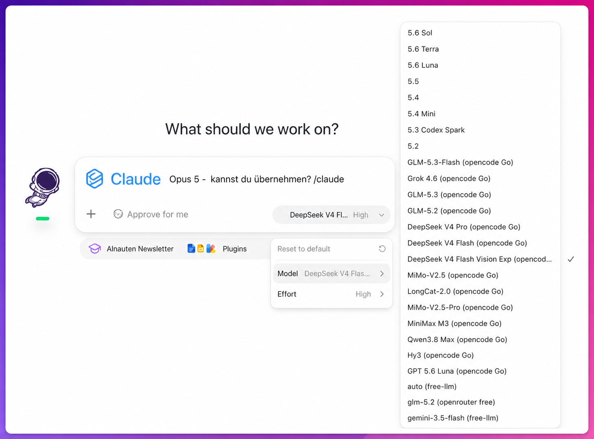

# Bridge & Picker

> **English TL;DR** — This repo upgrades your AI desktop apps with each other, using the subscriptions you already pay for: call Claude from ChatGPT Work via `/claude` (and vice versa), pull extra models like DeepSeek, GLM, MiniMax, Qwen and Grok straight into the ChatGPT Work model picker — kept current by a daily model sync — and hand a long chat over to a fresh one with `/handoff`. To install, hand the one-line instruction below to your AI agent — it does the rest. The playbook is written in German, but your agent will talk to you in your own language.

Rüste deine AI-Desktop-Apps gegenseitig auf — mit deinen bestehenden Abos, ohne teure Einzel-APIs:

- **Die Brücke:** Rufe aus ChatGPT Work/Codex per `/claude` dein Claude-Abo auf (und umgekehrt per `/codex` dein ChatGPT-Abo aus Claude Cowork/Code). Auch `/gemini` fürs Google-Abo.
- **Der Picker:** Hole zusätzliche Modelle (DeepSeek, GLM, MiniMax, Qwen, Grok u. a.) direkt in die Modellauswahl von ChatGPT Work/Codex — über eine OpenCode-Go-Subscription und optional kostenlose OpenRouter-Modelle.
- **Und er bleibt aktuell:** Ein täglicher Modell-Sync nimmt neue Modelle auf und wirft abgeschaltete raus, damit die Auswahl nicht auf dem Stand des Installationstags einfriert.
- **Der Handoff:** `/handoff` verdichtet ein langes Gespräch zu einem Übergabedokument für einen frischen Chat. Spart Kontext — und ist der einzige saubere Weg, das Modell zu wechseln, denn mitten im Gespräch geht das nicht.



*Das Ergebnis: ein Picker, alle deine Modelle — plus `/claude`, um dein Claude-Abo direkt aus ChatGPT Work aufzurufen.*

## Installation (ein Befehl)

Öffne deine AI-Desktop-App (ChatGPT Work/Codex **oder** Claude Cowork/Code) und gib ihr diesen Auftrag:

```
Klone https://github.com/MediaPublishing/chatgpt-work-claude-bridge-model-picker
in einen Arbeitsordner und folge exakt der Datei INSTALL.md in diesem Repo.
```

Dein Agent stellt dir dann ein paar Fragen (welche Abos du hast, was du willst) und richtet alles passend ein. Er fragt **nie** nach Passwörtern — Logins machst du immer selbst.

## Voraussetzungen

- macOS (Linux weitgehend analog; Windows nicht getestet)
- Für den Picker zusätzlich **Node.js 22.19 oder neuer** — das verlangt der Router. Für die Brücke allein reicht, was deine Apps mitbringen
- Mindestens eines: ChatGPT-Abo (mit Codex/ChatGPT Work), Claude-Abo (mit Claude Code/Cowork), Google-Gemini-Abo
- Für den Picker: eine [OpenCode-Go-Subscription](https://opencode.ai/go) und/oder ein kostenloses OpenRouter-Konto

### Zu OpenCode Go

OpenCode Go ist die primäre Empfehlung für den Picker: ein Flat-Abo statt Token-Abrechnung, damit sind die Kosten planbar.

Über einen Referral-Link ist der erste Monat oft günstiger (Größenordnung ~5 $, danach ~10 $/Monat). Links sammeln sich im [Referral-Thread in r/opencode](https://www.reddit.com/r/opencode/comments/1ubzi1z/opencode_go_referral_thread_drop_your_links/). **Prüf die aktuellen Konditionen immer bei OpenCode selbst** — Preise und Aktionen ändern sich, und die Zahlen hier sind eine Momentaufnahme. Dein Agent darf auch kurz nach einem aktuellen Deal suchen, bevor du abschließt.

## Prinzipien

1. **Subscriptions vor APIs.** Abos haben planbare Fixkosten; Token-APIs laufen unbemerkt ins Geld. Alles hier ist auf Abo-Nutzung ausgelegt.
2. **Nur offizielle Wege.** Offizielle CLIs und der geprüfte, auf einen Commit gepinnte [codex-router](https://github.com/duolahypercho/codex-router). Keine UI-Automation, keine Abo-Logins in Dritt-Tools — das riskiert Kontosperren.
3. **Keys bleiben lokal.** API-Keys wandern nie durch den Chat, sondern in Dateien mit Rechten 0600.
4. **Jeder Schritt mit Beleg.** Die Installation verifiziert jede Etappe mit einem echten Testlauf und schreibt einen Checkpoint — bricht etwas ab (z. B. ein Modell-Limit), setzt der nächste Lauf exakt dort auf.

## Was liegt wo

| Pfad | Inhalt |
|---|---|
| `INSTALL.md` | Das Playbook für deinen Agenten — Interview, Module, Verifikation |
| `modules/` | Ein eigenständiges Playbook pro Baustein |
| `skills/` | Die Slash-Command-Vorlagen für beide Apps (`/claude`, `/codex`, `/gemini`, `/handoff`) |
| `tests/` | Tests für die Sync-Logik (`node --test "tests/*.test.mjs"`) |
| `tools/` | Hilfsskripte: täglicher Modell-Sync, Key-Verwaltung, Verbrauchsanzeige im Picker |
| `patches/` | Geprüfte Fixes gegen den gepinnten codex-router-Stand |
| `LEARNINGS.md` | Die wichtigsten Erkenntnisse und Fehlerbilder aus der Praxis |

## Probleme?

**Erst heilen lassen, dann melden.** Dein Agent hat einen Reparaturweg, und der löst die meisten Fälle:

1. Fehlerbild in `LEARNINGS.md` nachschlagen — die häufigsten Meldungen bedeuten etwas anderes, als sie sagen.
2. Den Rückweg des betroffenen Moduls nutzen (jedes Modul hat einen) und den Schritt **einmal** sauber wiederholen.
3. Erst wenn das nicht reicht: melden.

**Melden — mit den Details, die eine Antwort möglich machen.** Am liebsten als [GitHub-Issue](https://github.com/MediaPublishing/chatgpt-work-claude-bridge-model-picker/issues) (Pull Requests sind genauso willkommen). Kein GitHub-Konto? Dann eine E-Mail an **info@ainauten.com** mit denselben Angaben:

- Modul und Schritt, an dem es hängt (z. B. „03-router, Schritt 6")
- Die **exakte** Fehlermeldung, kopiert statt zusammengefasst
- Auszug aus `install-state.json` (der betroffene Schritt genügt)
- Betriebssystem und Version, `node --version`
- Router-Commit: `git -C ~/.local/share/codex-router log --oneline -1`
- Was du schon versucht hast (Schritte 1–3 oben)

**Niemals mitschicken:** API-Keys, Tokens, Passwörter, den Inhalt von `*.secret`-Dateien. Wenn ein Log einen Key enthält, ersetz ihn durch `[REDACTED]`. Ein Report ohne Key ist verwertbar; ein Key im Issue ist ein Sicherheitsvorfall.

## Credits: das Original

Die Picker-Technik basiert auf **[codex-router](https://github.com/duolahypercho/codex-router)** — volle Anerkennung an dessen Autoren. Die eigentliche Leistung, Fremdmodelle sauber in die Codex-Modellauswahl zu bringen, steckt dort.

Diese Installation pinnt einen von uns geprüften Commit und ergänzt wenige Kompatibilitäts-Patches (siehe `patches/`). Wer lieber dem Original und seinem neuesten Stand folgt, kann das jederzeit tun — dann entfallen unsere Patches. Die Prüf-Battery aus `modules/03-router.md` lohnt sich in dem Fall trotzdem: Ein Sicherheitsbefund gilt immer nur für den Commit, gegen den er erhoben wurde.

## Haftungsausschluss

Alles auf eigene Verantwortung. Die eingebundenen Dienste (OpenAI, Anthropic, Google, OpenCode, OpenRouter) können Konditionen, Limits und Modellverfügbarkeit jederzeit ändern — `LEARNINGS.md` erklärt die häufigsten Fehlerbilder und was sie wirklich bedeuten.

---

Enjoy — Feedback welcome! The AInauten-Team: [AInauten.com](https://ainauten.com) (Deutsch) · [AInauten.net](https://ainauten.net) (English)
